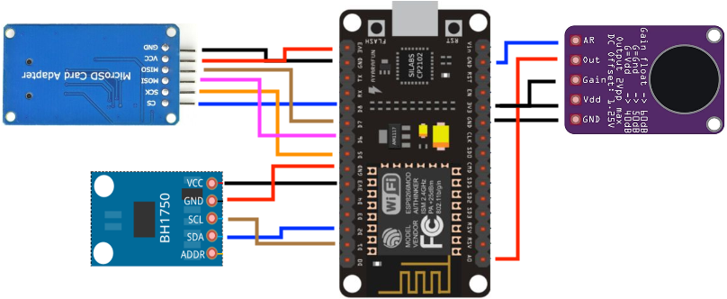

# ESP8266 Based Environment Sensor

## Table of Contents

- [Introduction](#introduction)
- [Assumed Hardware](#assumed-hardware)
- [Assumed Setup](#assumed-setup)
- [Installation](#installation)
- [Usage](#usage)
- [Configuration](#configuration)

## Introduction

This ESP8266 Sensor project was developed as part of a Master thesis at the Digital Interaction Lab of the University of Amsterdam. It measures Sound Level, Light Level, and Devices in proximity (allowing approximation of occupancy rate later). The data will be used in combination with occupant feedback to assess comfort and usability of university spaces.

## Assumed Hardware

- NodeMCU ESP8266 12.0
- MAX9814 with Microphone
- BH1750FVI Light sensor with light ball diffuser
- Micro SD TF Card Adapter Reader Module

## Assumed Setup

## Installation

1. Install [PlatformIO](https://platformio.org/) for [VSCode](https://code.visualstudio.com/).
2. Install the [PlatformIO extension](https://marketplace.visualstudio.com/items?itemName=platformio.platformio-ide) for VSCode.
3. Clone the repository.
4. Create a copy of the `credentials_template.h` file named `credentials.h` and fill in the WiFi SSID and password.
5. Deploy the code to the Sensor setup and collect data.

## Usage

The ESP8266 environment sensor project uses three main sensors to measure different parameters.

**Device counting through probe requests** is achieved by putting the WiFi module of the ESP8266 into promiscuous mode. This enables the triggering of a callback function when a communication is detected on the current WiFi channel. Only messages identified as probe requests are further processed. The sensor scans channels 1 to 14 and purges devices that are not seen again after a certain time. Devices are grouped into strong, middle, and weak signal groups, and their counts are written to the connected SD card. To avoid personal data collection, no MAC addresses are logged or stored long-term (even though iOS and Android devices now randomize their probe request MAC addresses).

The **Light Sensor** is simple to use. Once initialized, it can be polled at any time to obtain the ambient light intensity.

The **Sound Sensor** (MAX9814) offers several configuration options, such as changing AR and Gain, as well as introducing calibration offset functions before writing to the SD card. Connecting AR to GND and GAIN to VCC worked best for my use case. The output voltage is recorded over a measurement timeframe, and the peaks are stored. Based on the min and max peak, the difference in pressure and therefore decibels can be calculated. Accounting for input voltage and analog input is also required. Due to the set gain on the MAX9814, external calibration is needed for decibel measurement. The set values might not work for your specific use case, so it is recommended to calibrate the sensor yourself.

For **SD Card storage**, the data is written to a micro SD card every minute since the ESP8266 cannot directly connect to the eduroam network present in the university building. The sensor initially waits for a WiFi connection to pull the current time from https://timeapi.io, making sensor synchronization easier. The sensor creates a LOG.txt and data.txt file on the SD card. Note that not all SD card manufacturers work well with this setup; compatibility seems to be hit or miss.

## Configuration

The following things could easily be changed for another application:

- Sound Sensor GAIN and AR.
- Device purge time.
- Device grouping boundaries.
- Sound sample interval
- General sampling interval
